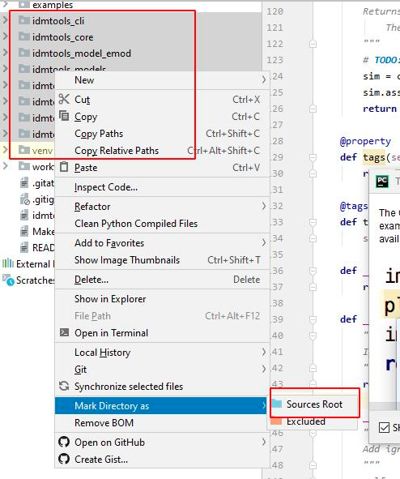

<!-- START doctoc generated TOC please keep comment here to allow auto update -->
<!-- DON'T EDIT THIS SECTION, INSTEAD RE-RUN doctoc TO UPDATE -->
**Table of Contents**

- [How to contribute to idmtools](#how-to-contribute-to-idmtools)
- [Development Guide](#development-guide)
  - [Submitting patches](#submitting-patches)
  - [First time setup](#first-time-setup)
  - [Start coding](#start-coding)
  - [Overview of Development Environment](#overview-of-development-environment)
  - [Run test/linting on code change](#run-testlinting-on-code-change)
  - [IDE/Runtime Setup](#ideruntime-setup)
  - [Setting Up WSL2 on Windows for Container platform/Development (Most Windows users should have WSL2 installed already)](#setting-up-wsl2-on-windows-for-container-platformdevelopment-most-windows-users-should-have-wsl2-installed-already)
  - [Development installation](#development-installation)
  - [Troubleshooting the Development Environment](#troubleshooting-the-development-environment)
- [Documentation](#documentation)
  - [Editing the Documentation](#editing-the-documentation)
  - [Reload Documentation on change](#reload-documentation-on-change)
- [Test](#test)
  - [Test Reports](#test-reports)
  - [Running all tests from Github Actions](#running-all-tests-from-github-actions)
  - [Running specific tests from the command line](#running-specific-tests-from-the-command-line)
  - [Installing from a Pull Request](#installing-from-a-pull-request)
  - [Installing From Development Branch(or other specific branch)](#installing-from-development-branchor-other-specific-branch)

<!-- END doctoc generated TOC please keep comment here to allow auto update -->

# How to contribute to idmtools

Thank you for considering contributing to idmtools!

# Development Guide

This section is intended for developers who would like to contribute to idmtools. It is also applicable to testing idmtools. 

*Any references to the `make` command should be replaced with the `pymake` command on Windows*

## Submitting patches

If there is not an open issue for what you want to submit, prefer opening one for discussion before working on a PR. You can work on any issue that doesn't have an open PR linked to it or a maintainer assigned
to it. These show up in the sidebar. No need to ask if you can work on an issue that interests you.

Include the following in your patch:

-   Include tests if your patch adds or changes code. Make sure the test
    fails without your patch.
-   Update any relevant docs pages and docstrings.
-   Open a Issue with clear title of the new feature/bug fix and link to the PR

## First time setup

1) Clone the repository:
   ```bash
   > git clone https://github.com/InstituteforDiseaseModeling/idmtools.git
   ```
2) Create a virtualenv. On Windows, please use venv to create the environment
   `python -m venv idmtools`
   On Unix(Mac/Linux) you can use venv or virtualenv
3) Activate the virtualenv
4) Run `docker login docker-staging.packages.idmod.org -u yourusername -p yourpassword`  # you need to have an idm jfrog account. This step is only needed if you are using docker image from/to staging artifactory.
5) Then run `python dev_scripts/bootstrap.py`. This will install all the tools. A note about bootstrap.py. It adds a configuration to the examples folder which points all examples to staging environments. This is so when in dev/test mode, examples can be run in a non-production environments.

## Start coding

-   Create a branch to identify the issue you would like to work on. If you're submitting a bug or documentation fix, branch off of the latest ".x" branch.

    ```bash
    $ git fetch origin
    $ git checkout -b your-branch-name origin/main
    ```
    If you're submitting a feature addition or change, branch off of the "dev" branch.

    ```bash
    $ git fetch origin
    $ git checkout -b your-branch-name origin/dev
    ```
-   Using your favorite editor, make your changes, `committing as you go`.
-   Include tests that cover any code changes you make. Make sure the test fails without your patch. Run the tests as described below.
-   Push your commits to your fork on GitHub and `create a pull request`. Link to the issue being addressed with
    ``fixes #123`` in the pull request.

    ```bash
    git push --set-upstream fork your-branch-name
    ```

- [Committing as you go](https://dont-be-afraid-to-commit.readthedocs.io/en/latest/git/commandlinegit.html#commit-your-changes)
- Run `pymake lint` or `make lint` before opening a PR and fix all linting errors
- [Create a pull request](https://help.github.com/en/articles/creating-a-pull-request)

## Overview of Development Environment

After the first install almost everything you need as a developer is part of the makefiles. Within each project directory, there is a Makefile that contains all the development related tasks. There is also a makefile at the top-level of the project.

To use the makefiles you can explore the available commands by running `make help`. On Windows, use `pymake help`

Here are a list of common commands, (type `pymake help` or `make help` to see the full list)

```bash
setup-dev   -   Setup dev environment(assumes you already have a virtualenv)
setup-dev-no-docker -   Setup dev environment(assumes you already have a virtualenv) exlcuding docker builds for the local platform
clean       -   Clean up temporary files
clean-all   -   Deep clean project
lint        -   Lint package and tests
test        -   Run Unit tests
test-all    -   Run Tests that require docker and external systems
coverage    -   Run tests and generate coverage report that is shown in browser
```

Some packages have unique build related commands, Use `make help` to identify specific commands

## Run test/linting on code change

There is a utility command to run linting and tests on code changes. It runs within each package directory. For example, changes to
files in `idmtools_core` will run the `make lint` and `make test-smoke` tests within the idmtools_core directory. 

## IDE/Runtime Setup

For source completion and indexing, set the package paths in your IDE. In PyCharm, select the following directories then right-click and select `Mark Directory as -> Source Root`.



The directories that should be added as source roots are
- `idmtools/idmtools_cli`
- `idmtools/idmtools_core`
- `idmtools/idmtools_models`
- `idmtools/idmtools_platform_comps`
- `idmtools/idmtools_platform_container`
- `idmtools/idmtools_platform_general`
- `idmtools/idmtools_platform_slurm`
- `idmtools/idmtools_test`

## Setting Up WSL2 on Windows for Container platform/Development (Most Windows users should have WSL2 installed already)

1. Enable WSL (Windows Subsystem for Linux)
   ```powershell
   wsl --install
    ```
2. Set WSL2 as default:
   ```powershell
   wsl --set-default-version 2
   ```
   This will set WSL2 as the default for all new Linux distributions. If you have an existing distribution, you can convert it to WSL2 by running the following command in a powershell window:
   ```powershell
   wsl --set-version <Distro> 2
   ```
## Development installation
1. Install the required packages
   ```bash
   make setup-dev
   Or python dev_scripts/bootstrap.py
   ```
   or on Windows
   ```powershell
   pymake setup-dev
   Or python dev_scripts\bootstrap.py
   ```

## Troubleshooting the Development Environment

1. Docker Auth issues
   
   Idmtools currently does not prompt users for docker credentials. Because of this, user must login
   beforehand using `docker login docker-staging.packages.idmod.org`
2. Docker image not found issue
   
   Rerun `pymake setup-dev` on Windows or `make setup-dev` command on unix systems
3. Dev install get stuck with cmd: `pymake setup-dev` or `python dev_scripts\bootstrap.py`
   
   Sometimes dev install command can get stuck on some packages. This most likely due to users company credential changed
   (login username/password). This should only happen on first time after changed credentials. To overcome it, try to 
   install issued package in the folder first, for example, to install idmtools_platform_comps package directly, run:
   `cd idmtools_platform_comps`
   `pip install -e .`
   It may prompt to enter User (i.e: User for packages.idmod.org:), hit 'Enter' key. This should release installing the 
   dependency packages from production artifactory or public pypi server. Once successfully installed once, user should 
   not need to do this step anymore.
   
# Documentation

The following section documents how to build and edit the documentation.

## Editing the Documentation

The documentation is built using Sphinx from the rst files in the `docs` folder. The documentation is a series of linked
documents and generated documents from the python code. `index.rst` is the entry point into the documentation. For details
on the formatting of documentation, see the [Sphinx](https://www.sphinx-doc.org/en/stable/) docs

There are two make jobs related to documentation

```bash
build-docs          :build docs
build-docs-server   :builds docs and launch a webserver and watches for changes to documentation
```

See the next section for details on `build-docs-server`

## Reload Documentation on change

You can use the `make build-docs-server` feature to build doc automatically. This runs a local python documentation server running at
http://localhost:8000. Any changes you make to the python files or rst files, the documentation will be reloaded in the browser.

```bash
make build-docs-server 
```

# Test

The following section is an overview of test for idmtools. All tests are located under the `tests` folder in each package folder. 
Test are written to be run my `py.test`. The test are partially configured through the pytest.ini. Additional test configuration happens
dynamically through the `make test` commands. 

Here are a list of jobs related to test from the makefile.

```bash
coverage            :Generate a code-coverage report
coverage-all        :Generate a code-coverage report using all tests
coverage-report     :Generate HTML report from coverage. Requires running coverage run first(coverage, coverage-smoke, coverage-all)
coverage-smoke      :Generate a code-coverage report
test                :Run default set of tests which exclude comps and docker tests
test-all            :Run all our tests
test-comps          :Run our comps tests
test-docker         :Run our docker tests
test-failed         :Run only previously failed tests
test-long           :Run any tests that takes more than 30s
test-no-long        :Run any tests that takes less than 30s
test-python         :Run our python tests
test-report         :Launch test report in browser
test-smoke          :Run our smoke tests
```

The jobs can be run at the root of the project or the within each package.

The root also has additional jobs at the root. Those jobs are
```
aggregate-html-reports:Aggregate html test reports into one directory
allure-report       :Download report as zip
coverage-report     :Generate coverage report for tests already ran
start-allure        :start the allue docker report server
stop-allure         :Stop Allure
test-all-allure     :Run all tests and enable allure
test-smoke-allure   :Run smoke tests and enable allure
```

## Test Reports

Allure is a test visualization utility. It can be accessed after running `make test-all-allure` or `make test-smoke-allure` at http://localhost:5050/allure-docker-service/latest-report in the root of the repo.

There is also a html report available after running any tests http://localhost:8001. To view this report, run `make aggregate-html-reports` from the root. There will be multiple html files. Each file represents a specific run of tests for a package. 
Some packages, the ones that have both serial and parallel tests, will have two files. The file generated by serial tests will have the prefix `serial.`. 

There is also a coverage report available. It can only be viewed after running `coverage-smoke` or `coverage` rules. It can then be viewed with `coverage-report`

## Running all tests from Github Actions

To run all tests from Github Actions, go to Actions tab in Github repo and select one of the workflows:
* run_dev_install_all_tests.yml <-- This will run all tests with dev install on idm staging COMPS environment
* run_pip_prod_all_tests.yml  <-- This will run all tests with pip install production packages on idm staging COMPS environment
* run_pip_stage_all_tests.yml  <-- This will run all tests with pip install staging packages on idm staging COMPS environment

Then select Run Workflows dropdown and select the branch you want to run the tests on. This will run all tests in the repo.

## Running specific tests from the command line

To run a select set of tests, you can use the `run_all.py` python script

For example to run all tests that tagged python but not tagged comps run

```bash
python dev_scripts/run_all.py -sd 'tests' --exec "py.test -m 'not comps and python'"
```
You can also filter by test case name or method name. The below will run any test with batch in the name.
```bash
python dev_scripts/run_all.py -sd 'tests' --exec "py.test -k 'batch'"
```
To run a specific test, cd to the project directories test folder and run
```bash
py.test test_templated_simulation.py::TestTemplatedSimulation::test_generator
```

In addition, you can rerun just the failed test using either the top-level `pymake test-failed` rule or by using the `--lf` switch on py.test

## Installing from a Pull Request

Sometimes, like when testing a new feature, it is useful to install a development or early version. We can do this directly from GitHub PRs using the following commands

To install idmtools from a specific PR you can use the following script replacing 123 with the number of your PR

```
pip install git+https://github.com/InstituteforDiseaseModeling/idmtools.git@refs/pull/123/head#egg="idmtools&subdirectory=idmtools_core"
pip install git+https://github.com/InstituteforDiseaseModeling/idmtools.git@refs/pull/123/head#egg="idmtools_platform_comps&subdirectory=idmtools_platform_comps"
... pip install other packages
```

To install from a specific branch, see [Installing From Development Branch(or other specific branch)](#installing-from-development-branchor-other-specific-branch)

You can use either *git+https://* or *git+ssh://git@*

## Installing From Development Branch(or other specific branch)

To install from the development branch, use the following commands

```
pip install git+https://github.com/InstituteforDiseaseModeling/idmtools.git@dev#egg="idmtools&subdirectory=idmtools_core"
pip install git+https://github.com/InstituteforDiseaseModeling/idmtools.git@dev#egg="idmtools_platform_comps&subdirectory=idmtools_platform_comps"
... pip install other packages
```

To install a different github branch, change the *@dev* in each command to *@<branch name>* where *branch_name* is the name of branch you would like to install from. To install from a PR, see [Installing from a Pull Request](#installing-from-a-pull-request)

You can use either *git+https://* or *git+ssh://git@*