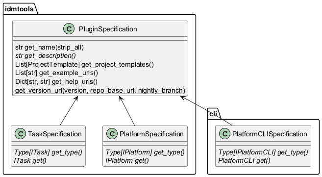

<!-- START doctoc generated TOC please keep comment here to allow auto update -->
<!-- DON'T EDIT THIS SECTION, INSTEAD RE-RUN doctoc TO UPDATE -->
**Table of Contents**

- [Sphinx → MkDocs Documentation Migration](#sphinx-%E2%86%92-mkdocs-documentation-migration)
  - [Project Context](#project-context)
  - [Migration Overview](#migration-overview)
  - [Phase 1: Install MkDocs and Plugins](#phase-1-install-mkdocs-and-plugins)
  - [Phase 2: Create `mkdocs.yml`](#phase-2-create-mkdocsyml)
  - [Phase 3: Build the `nav:` Structure](#phase-3-build-the-nav-structure)
  - [Phase 4: Convert RST Files to Markdown](#phase-4-convert-rst-files-to-markdown)
    - [4.1 Expand Substitution Variables](#41-expand-substitution-variables)
    - [4.2 Headings](#42-headings)
    - [4.3 Cross-References](#43-cross-references)
    - [4.4 Admonitions / Directives](#44-admonitions--directives)
    - [4.5 Code Blocks](#45-code-blocks)
    - [4.7 Images](#47-images)
    - [4.8 UML Diagrams](#48-uml-diagrams)
    - [4.10 toctree Directives](#410-toctree-directives)
    - [4.11 Include Directives](#411-include-directives)
    - [4.12 Glossary](#412-glossary)
    - [4.13 Version Directives](#413-version-directives)
    - [4.14 Anchors / Labels](#414-anchors--labels)
  - [Phase 5: API Documentation](#phase-5-api-documentation)
  - [Phase 6: Static Assets](#phase-6-static-assets)
  - [Phase 7: Build and Verify](#phase-7-build-and-verify)
  - [Recommended Conversion Order](#recommended-conversion-order)
  - [Files to Delete After Migration](#files-to-delete-after-migration)
  - [Handling Redirects](#handling-redirects)

<!-- END doctoc generated TOC please keep comment here to allow auto update -->

---
name: sphinx-to-mkdocs
description: Converts Sphinx RST documentation to MkDocs Markdown format. Use this skill whenever the user asks to migrate, convert, or port documentation from Sphinx to MkDocs, wants to replace conf.py with mkdocs.yml, needs to convert .rst files to .md, wants to switch from Sphinx to MkDocs Material theme, or asks about modernizing Python project documentation. Also trigger for requests like "migrate docs to mkdocs", "convert rst to markdown for docs site", or "replace sphinx with mkdocs".
---

# Sphinx → MkDocs Documentation Migration

This skill guides a complete migration from a Sphinx-based documentation setup (`.rst` files, `conf.py`, `Makefile`) to MkDocs (`.md` files, `mkdocs.yml`).

## Project Context

The current project (`idmtools`) has these Sphinx artifacts to convert:
- `docs/conf.py` — Sphinx configuration
- `docs/index.rst` — master toctree
- `docs/**/*.rst` — all content pages
- `docs/variables.txt` — substitution variables (`|IT_s|`, `|IDM_s|`, etc.)
- `docs/_static/` — CSS overrides and static assets
- `docs/_templates/` — Jinja2 HTML templates
- `docs/Makefile` — build targets
- `docs/api_templates/` — sphinx-apidoc templates

## Migration Overview

Work through phases in order. Each phase is independent enough to commit separately.

---

## Phase 1: Install MkDocs and Plugins

```bash
pip install mkdocs mkdocs-material mkdocstrings[python] \
    mkdocs-gen-files mkdocs-literate-nav mkdocs-section-index \
    mkdocs-autorefs pymdown-extensions
```

For PlantUML diagrams (the project uses `.. uml::` directives):
```bash
pip install mkdocs-plantuml-local  # or handle via pre-rendered images
```

---

## Phase 2: Create `mkdocs.yml`

Place `mkdocs.yml` at the repository root (not inside `docs/`). Map fields from `conf.py`:

```yaml
site_name: idmtools
site_url: https://institutefordiseasemodeling.github.io/idmtools/
repo_url: https://github.com/InstituteforDiseaseModeling/idmtools
repo_name: InstituteforDiseaseModeling/idmtools
copyright: "1999 - 2026, Gates Foundation. All rights reserved"

docs_dir: docs
site_dir: site

theme:
  name: material
  logo: images/idm-logo-transparent.png
  favicon: images/favicon.ico
  features:
    - navigation.tabs
    - navigation.sections
    - navigation.expand
    - navigation.top
    - search.highlight
    - content.code.copy
  palette:
    - scheme: default
      toggle:
        icon: material/brightness-7
        name: Switch to dark mode
    - scheme: slate
      toggle:
        icon: material/brightness-4
        name: Switch to light mode

plugins:
  - search
  - mkdocstrings:
      handlers:
        python:
          options:
            members_order: source
            show_source: true
  - gen-files:
      scripts:
        - docs/gen_ref_pages.py
  - literate-nav:
      nav_file: SUMMARY.md
  - section-index

markdown_extensions:
  - pymdownx.highlight:
      anchor_linenums: true
  - pymdownx.superfences:
      custom_fences:
        - name: plantuml
          class: plantuml
          format: !!python/name:pymdownx.superfences.fence_code_format
  - pymdownx.snippets:
      base_path: ["."]
  - pymdownx.tabbed:
      alternate_style: true
  - pymdownx.tasklist:
      custom_checkbox: true
  - admonition
  - def_list
  - attr_list
  - md_in_html
  - tables
  - footnotes
  - toc:
      permalink: true
  - pymdownx.arithmatex:
      generic: true

extra_css:
  - _static/theme_overrides.css

extra_javascript:
  - https://polyfill.io/v3/polyfill.min.js?features=es6
  - https://cdn.jsdelivr.net/npm/mathjax@3/es5/tex-mml-chtml.js
```

---

## Phase 3: Build the `nav:` Structure

The `nav:` block in `mkdocs.yml` replaces Sphinx's `.. toctree::` directives. Derive it from `docs/index.rst` and all nested `.. toctree::` blocks.

**Process:**
1. Open `docs/index.rst` — its top-level `.. toctree::` entries become the top `nav:` items.
2. For each entry in that toctree, open the referenced `.rst` file and extract its nested `.. toctree::` to build sub-nav.
3. A toctree entry like `platforms/platforms` means the file `docs/platforms/platforms.rst`, which becomes `docs/platforms/platforms.md`.
4. The `:caption:` option on a toctree becomes the nav section label.

**Example translation** from `docs/index.rst`:
```rst
.. toctree::
   :maxdepth: 3
   installation
   configuration
   platforms/platforms
   analyzers/analyzers
```

Becomes in `mkdocs.yml`:
```yaml
nav:
  - Home: index.md
  - Installation: installation.md
  - Configure: configuration.md
  - Platforms:
      - Overview: platforms/platforms.md
      - COMPS: platforms/comps/platforms-comps.md
      - SLURM: platforms/slurm/index.md
      - Container: platforms/container/index.md
  - Analyzers:
      - Overview: analyzers/analyzers.md
      - ...
```

Use the RST page title (the text above the `===` line) as the nav label.

---

## Phase 4: Convert RST Files to Markdown

For each `.rst` file, create a `.md` file in the same location. Apply these transformations in order:

### 4.1 Expand Substitution Variables

`docs/variables.txt` defines variables like `|IT_s| replace:: idmtools`. Before converting, replace all occurrences:

| Variable | Expansion |
|---|---|
| `\|IT_s\|` | `idmtools` |
| `\|IDM_s\|` | `IDM` |
| `\|IDM_l\|` | `Institute for Disease Modeling (IDM)` |
| `\|EMOD_s\|` | `EMOD` |
| `\|EMOD_l\|` | `Epidemiological MODeling software (EMOD)` |
| `\|SSMT_l\|` | `Server-Side Modeling Tools (SSMT)` |
| `\|SSMT_s\|` | `SSMT` |
| `\|COMPS_l\|` | `Computational Modeling Platform Service (COMPS)` |
| `\|COMPS_s\|` | `COMPS` |
| `\|SLURM_s\|` | `SLURM` |
| `\|Python_IT\|` | `Python 3.8/3.9/3.10/3.11/3.12 x64-bit` |
| `\|DT\|` | `DTK-Tools` |

Remove the `.. include:: /variables.txt` line that appears via `rst_epilog`.

### 4.2 Headings

RST uses underline characters for heading levels. MkDocs uses `#` prefixes.

```rst
=================
Page Title Here
=================

Section Heading
===============

Subsection
----------

Sub-subsection
~~~~~~~~~~~~~~
```

Becomes:
```markdown
# Page Title Here

## Section Heading

### Subsection

#### Sub-subsection
```

The top-level title with `===` above and below is level 1 (`#`). Subsequent levels depend on the order they appear in the file.

### 4.3 Cross-References

| RST | Markdown |
|---|---|
| `:doc:\`analyzers/analyzers\`` | `[Analyzers](analyzers/analyzers.md)` |
| `:doc:\`../configuration\`` | `[Configure](../configuration.md)` |
| `:ref:\`idmtools-prereqs\`` | `[Prerequisites](#prerequisites)` (anchor from heading) |
| `:term:\`assets\`` | `[assets](glossary.md#assets)` |
| `:py:class:\`~idmtools.entities.simulation.Simulation\`` | `` [`Simulation`][idmtools.entities.simulation.Simulation] `` (with mkdocstrings) |
| `:py:func:\`~idmtools.core.platform_factory.Platform\`` | `` [`Platform`][idmtools.core.platform_factory.Platform] `` |
| `\`text <url>\`__` | `[text](url)` |
| `\`text <url>\`_` | `[text](url)` |
| `` `code` `` | `` `code` `` (same) |

For `:py:class:` and `:py:func:`, the `~` prefix means "show only the class name, not the full path" — use the short name in the link text.

### 4.4 Admonitions / Directives

```rst
.. note::

   This is a note.

.. warning::

   This is a warning.

.. important::

   This is important.

.. tip::

   This is a tip.
```

Becomes (MkDocs Material admonitions):
```markdown
!!! note
    This is a note.

!!! warning
    This is a warning.

!!! important
    This is important.

!!! tip
    This is a tip.
```

Supported types: `note`, `warning`, `danger`, `tip`, `info`, `success`, `question`, `failure`, `bug`, `example`, `quote`.

Map `.. important::` → `!!! important`, `.. caution::` → `!!! warning`, `.. hint::` → `!!! tip`.

For collapsible admonitions, use `???` instead of `!!!`.

### 4.5 Code Blocks

**Explicit code-block directive:**
```rst
.. code-block:: python

   x = 1
   y = 2
```

Becomes:
```markdown
```python
x = 1
y = 2
```
```

**Inline `::` code block** (paragraph ending with `::` followed by indented block):
```rst
Example configuration::

    [COMPS]
    type = COMPS
```

Becomes:
```markdown
Example configuration:

```ini
[COMPS]
type = COMPS
```
```

Guess the language from context (ini for config files, python for Python code, bash for shell).

### 4.6 Literal Includes

```rst
.. literalinclude:: ../examples/builders/experiment_builder_python.py
    :language: python
```

Option A — Copy file and embed directly:
```markdown
```python
--8<-- "examples/builders/experiment_builder_python.py"
```
```

Option B — Link to GitHub source (simpler if file won't be in docs):
```markdown
[View source on GitHub](https://github.com/InstituteforDiseaseModeling/idmtools/blob/main/examples/builders/experiment_builder_python.py)
```

Prefer Option A when the `pymdownx.snippets` extension is configured (it is in the mkdocs.yml above).

If `:lines: 1-20` is specified, copy only those lines manually.

### 4.7 Images

```rst
.. image:: ../images/mapreduce-idmtools.png
            :scale: 75%

.. image:: ../images/foo.png
    :alt: Description
    :align: center
```

Becomes:
```markdown
{ width="75%" }

{ align=center }
```

The `attr_list` extension (included above) supports the `{ }` attribute syntax.

### 4.8 UML Diagrams

The project uses `.. uml::` (plantweb/PlantUML). Two options:

**Option A** — Use pre-rendered PNG images (simplest):
```markdown

```
The `docs/diagrams/` folder already has `.png` files alongside `.puml` sources.

**Option B** — Use the plantuml superfence:
```markdown
```plantuml
hide stereotype
skinparam component {
  BackgroundColor<<idmtools>> 40FF40
}
[idmtools] <<idmtools>>
```
```

Option A is recommended since the rendered PNGs already exist.

### 4.9 Tables

**CSV table:**
```rst
.. csv-table::
    :header: Output format, Object loaded to analyzer
    :widths: 10, 30

    JSON, A dictionary
    CSV, A pandas DataFrame
```

Becomes:
```markdown
| Output format | Object loaded to analyzer |
|---|---|
| JSON | A dictionary |
| CSV | A pandas DataFrame |
```

**RST grid/simple tables** → standard Markdown tables.

### 4.10 toctree Directives

Remove all `.. toctree::` blocks from page content — navigation is handled by `nav:` in `mkdocs.yml`. The toctrees are only used to derive the nav structure (Phase 3).

### 4.11 Include Directives

```rst
.. include:: /reuse/comps_note.txt
```

Options:
- If `reuse/comps_note.txt` is plain text/RST → convert to `.md` and use snippets: `--8<-- "docs/reuse/comps_note.md"`
- If the content is short → inline it directly

### 4.12 Glossary

```rst
.. glossary::

   assets
      Files used in a simulation run.

   experiment
      A collection of related simulations.
```

Becomes (using `def_list` extension):
```markdown
assets
:   Files used in a simulation run.

experiment
:   A collection of related simulations.
```

### 4.13 Version Directives

```rst
.. versionadded:: 1.5.0

   New feature description.

.. deprecated:: 2.0.0

   Use new_function instead.
```

Becomes:
```markdown
!!! info "New in version 1.5.0"
    New feature description.

!!! warning "Deprecated since 2.0.0"
    Use new_function instead.
```

### 4.14 Anchors / Labels

```rst
.. _idmtools-prereqs:

Prerequisites
=============
```

RST labels become HTML anchors automatically from headings in MkDocs. For `:ref:` links to these, link to the heading anchor: `[Prerequisites](#prerequisites)`. Remove the label line entirely.

---

## Phase 5: API Documentation

The project uses `sphinx.ext.autodoc` + `sphinx-apidoc` to generate API docs from docstrings. In MkDocs, use `mkdocstrings`.

**Create `docs/gen_ref_pages.py`** (used by the `gen-files` plugin):

```python
"""Generate API reference pages from Python source."""
from pathlib import Path
import mkdocs_gen_files

packages = [
    ("idmtools_core", "idmtools"),
    ("idmtools_models", "idmtools_models"),
    ("idmtools_platform_comps", "idmtools_platform_comps"),
    ("idmtools_platform_slurm", "idmtools_platform_slurm"),
    ("idmtools_platform_container", "idmtools_platform_container"),
]

for package_dir, module_name in packages:
    src = Path(f"../{package_dir}/{module_name}")
    for path in sorted(src.rglob("*.py")):
        module_path = path.relative_to(src.parent).with_suffix("")
        doc_path = Path("api") / path.relative_to(src.parent).with_suffix(".md")
        full_doc_path = Path("docs") / doc_path

        parts = list(module_path.parts)
        if parts[-1] == "__init__":
            parts = parts[:-1]
        elif parts[-1] == "__main__":
            continue

        with mkdocs_gen_files.open(doc_path, "w") as fd:
            ident = ".".join(parts)
            fd.write(f"::: {ident}\n")

        mkdocs_gen_files.set_edit_path(doc_path, path)
```

**Replace each auto-generated RST** like:
```rst
.. automodule:: idmtools.entities.simulation
   :members:
```

With a Markdown file:
```markdown
# idmtools.entities.simulation

::: idmtools.entities.simulation
```

---

## Phase 6: Static Assets

- Keep `docs/_static/theme_overrides.css` — referenced in `mkdocs.yml` as `extra_css`
- Remove `docs/_templates/` — MkDocs Material uses its own templating system
- Keep `docs/images/`, `docs/diagrams/` — paths remain the same
- Remove `docs/Makefile` and `docs/conf.py`

---

## Phase 7: Build and Verify

```bash
# Build the site
mkdocs build --strict

# Serve locally with live reload
mkdocs serve

# Check for broken links (install linkchecker separately)
mkdocs build && linkchecker site/
```

Fix warnings one by one. Common issues:
- Broken relative links (adjust `../` path depth for moved files)
- Missing images (check case sensitivity)
- mkdocstrings import errors (add `__init__.py`, check sys.path)

---

## Recommended Conversion Order

1. Start with simple, self-contained pages (e.g., `faq.rst`, `glossary.rst`)
2. Then structural pages with toctrees (derive nav while converting)
3. Convert the API docs last (most complex)
4. Do `index.rst` → `index.md` last, after all other pages are in place

---

## Files to Delete After Migration

- `docs/conf.py`
- `docs/Makefile`
- `docs/make.bat` (if exists)
- `docs/_build/` (build output)
- `docs/_templates/`
- `docs/api_templates/`
- `docs/api/**/*.rst` (auto-generated, replaced by gen-files)
- `docs/variables.txt` (substitutions are now inlined)
- `docs/redirects.txt` (use `mkdocs-redirects` plugin if needed)

---

## Handling Redirects

The project uses `sphinxext.rediraffe` with `redirects.txt`. For MkDocs, use the `mkdocs-redirects` plugin:

```bash
pip install mkdocs-redirects
```

```yaml
# mkdocs.yml
plugins:
  - redirects:
      redirect_maps:
        'old-page.md': 'new-page.md'
```

Parse `docs/redirects.txt` to build this map.
