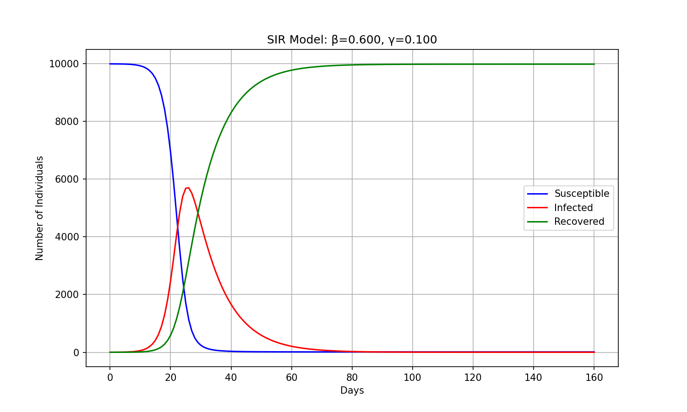

# Quick start

Run your first idmtools simulation using a SIR (Susceptible-Infected-Recovered) epidemiological model.

## Prerequisites

=== "Container"

    Install idmtools with Container platform support:

    ```bash
    pip install idmtools[container]
    ```

    No account required — simulations run locally in Docker containers.

=== "COMPS"

    Install idmtools with COMPS platform support:

    ```bash
    pip install idmtools[idm]
    ```

    You will also need:

    - A COMPS account (contact IDM to obtain credentials)
    - Network access to the COMPS endpoint
    - Your COMPS username and password ready for authentication

    See [COMPS Platform](../platforms/comps.md) for full setup details.

## Step 1: Create the model — `sir_model.py`

This script runs a discrete-time SIR model and writes results to `output.json` and a plot to `sir_curve.png`.

```python
# sir_model.py
import argparse
import os
import json
import matplotlib.pyplot as plt

def sir_model(N, beta, gamma, days, initial_infected=1):
    S = N - initial_infected
    I = initial_infected
    R = 0

    S_history = [S]
    I_history = [I]
    R_history = [R]

    for day in range(days):
        new_infections = beta * S * I / N
        new_recoveries = gamma * I

        S -= new_infections
        I += new_infections - new_recoveries
        R += new_recoveries

        S_history.append(S)
        I_history.append(I)
        R_history.append(R)

    results = {
        "S": S_history,
        "I": I_history,
        "R": R_history,
        "final_infected_total": R,
        "peak_infected": max(I_history),
        "peak_day": I_history.index(max(I_history))
    }

    with open("output.json", "w") as f:
        json.dump(results, f, indent=2)

    plt.figure(figsize=(10, 6))
    plt.plot(S_history, label="Susceptible", color="blue")
    plt.plot(I_history, label="Infected", color="red")
    plt.plot(R_history, label="Recovered", color="green")
    plt.xlabel("Days")
    plt.ylabel("Number of Individuals")
    plt.title(f"SIR Model: β={beta:.3f}, γ={gamma:.3f}")
    plt.legend()
    plt.grid(True)
    plt.savefig("sir_curve.png", dpi=150)
    plt.close()

    print(f"Simulation complete: Peak infected = {max(I_history):.0f} on day {I_history.index(max(I_history))}")
    return results

if __name__ == "__main__":
    parser = argparse.ArgumentParser(description="Run model with config file")
    parser.add_argument("--config", type=str, default="config.json")
    args = parser.parse_args()

    if os.path.exists(args.config):
        with open(args.config) as f:
            config = json.load(f)
    else:
        config = {"N": 10000, "beta": 0.5, "gamma": 0.1, "days": 160}

    sir_model(**config)
```

## Step 2: Create the experiment script — `run_python_sir.py`

```python
# run_python_sir.py
from idmtools.core.platform_factory import Platform
from idmtools.entities.experiment import Experiment
from idmtools_models.python.python_task import PythonTask

# Use Container platform for local execution
platform = Platform("Container", job_directory="DEST")

task = PythonTask(
    script_path="sir_model.py",
    python_path="python"
)

# Set model parameters
task.parameters = {
    "N": 10000,
    "beta": 0.5,
    "gamma": 0.1,
    "days": 160
}

# Create and run experiment
experiment = Experiment.from_task(
    task,
    name="SIR Python Model - Single Run"
)

experiment.run(
    platform=platform,
    wait_until_done=True
)

print(f"Experiment ID: {experiment.id}")
print(f"Status: {experiment.status}")
```

## Step 3: Run it

```bash
python run_python_sir.py
```

You should see output like:

```
Simulation complete: Peak infected = 2381 on day 37
Experiment ID: ...
Status: EntityStatus.SUCCEEDED
```

Simulation outputs are written to the `DEST/` job directory including 

## Next steps

- [Parameter sweeps](../tutorials/parameter-sweeps.md) — run multiple simulations with different `beta`/`gamma` values
- [Data analysis](../data-analysis/index.md) — aggregate results across simulations
- [Platforms](../platforms/index.md) — run on COMPS or Slurm instead
- [Tutorials](../tutorials/index.md) — more detailed walkthroughs
