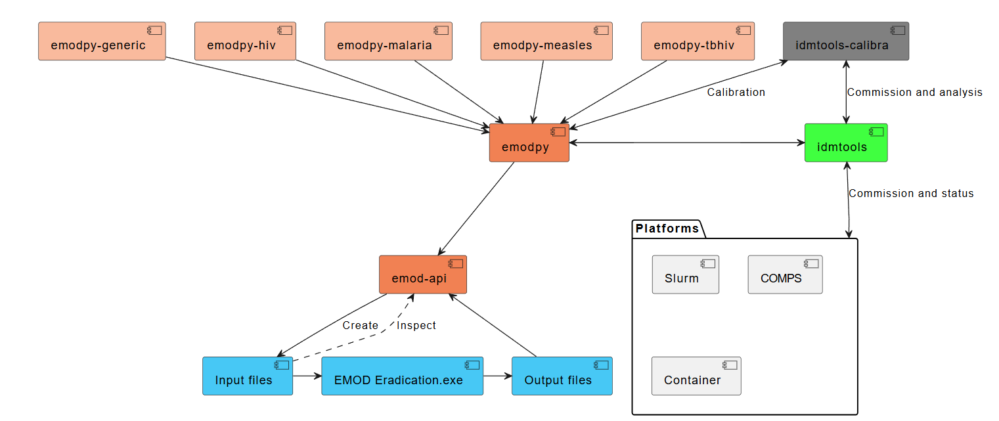
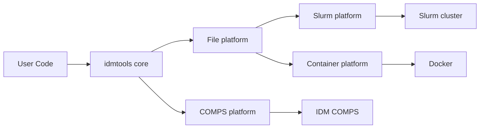

# Welcome to idmtools

**idmtools** is a collection of Python tools designed to streamline disease modeling workflows on HPC clusters and various compute platforms.

## idmtools workflow

idmtools provides a variety of options for each step of the modeling process. To accommodate different workflows, the tool suite is designed in a modular fashion, allowing users to select only the components they need. To simplify workflows, facilitate the modeling process, and make models and their results reusable and shareable, idmtools allows users to create and manage assets. Assets can be added at any level of the process — from running a specific task, to creating a simulation, to creating an experiment. The diagram below illustrates how idmtools and its related packages are used in an end-to-end workflow, using EMOD as the disease transmission model.

## Key features

- **Multi-Platform Support**: Run simulations on COMPS, Slurm, Docker containers, or locally
- **Model Agnostic**: Works with Python, R, and custom models
- **Flexible Workflows**: From input creation to calibration, commissioning, and analysis
- **Asset Management**: Share configurations and files across simulations
- **Parameter Sweeps**: Easily run parameter sweeps and sensitivity analyses
- **Data Analysis**: Aggregate and analyze simulation outputs using built-in analyzers and the AnalyzeManager

## Quick links

-   :material-clock-fast:{ .lg .middle } __Getting started__

    ---

    Install idmtools and run your first simulation in minutes.

    [:octicons-arrow-right-24: Installation](getting-started/installation.md)

-   :material-book-open-variant:{ .lg .middle } __User guide__

    ---

    Learn how to create simulations, run experiments, and analyze results.

    [:octicons-arrow-right-24: User guide](user-guide/index.md)

-   :material-school:{ .lg .middle } __Tutorials__

    ---

    Step-by-step tutorials for common workflows.

    [:octicons-arrow-right-24: Tutorials](tutorials/index.md)

-   :material-api:{ .lg .middle } __API reference__

    ---

    Complete API documentation for all modules.

    [:octicons-arrow-right-24: API docs](api/index.md)

## Supported platforms

idmtools supports multiple compute platforms:

- **COMPS** - Computational Modeling Platform Service
- **Slurm** - HPC Slurm cluster workload manager
- **Container** - Docker-based local execution

## Architecture

## Community

- **GitHub**: [institutefordiseasemodeling/idmtools](https://github.com/institutefordiseasemodeling/idmtools)
- **Issues**: Report bugs and request features on GitHub
- **PyPI**: [All idmtools packages](https://pypi.org/search/?q=idmtools)

