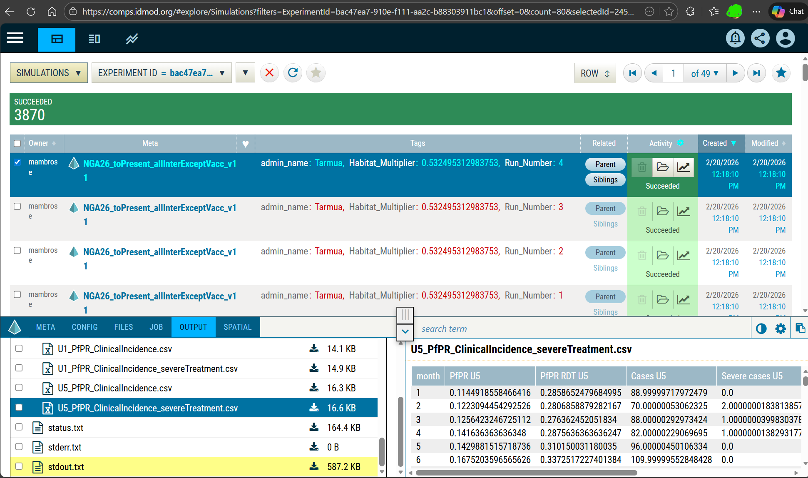

# COMPS platform

Comprehensive guide to using the COMPS platform (Computational Modeling Platform Service) with idmtools.



## Overview

**COMPS** is IDM's cloud-based high-performance computing platform designed for large-scale computational modeling. It provides scalable compute resources, data management, and job scheduling specifically optimized for disease modeling workflows.

## Key features

- **Cloud-Based**: No local compute resources needed
- **Massive Scale**: Run thousands of simulations simultaneously
- **Data Management**: Integrated storage and retrieval
- **Collaboration**: Share experiments and results with team members
- **Priority Queues**: Production and development environments
- **Azure Integration**: Leverages Microsoft Azure infrastructure

## Prerequisites

### 1. Account setup

Contact IDM to obtain COMPS access:
- COMPS account credentials
- Environment access (e.g. Nibbler)
- Network configuration

### 2. Installation

```bash
pip install idmtools[idm]
# or
pip install idmtools-platform-comps
```

### 3. Authentication

COMPS needs username and password to login.

## Basic configuration

### Predefined environments
- SLURMSTAGE
- CALCULON
- Nibbler
- SLURM
- SLURM2
- BOXY
- ...

To see a list of aliases and configuration options using the CLI command

```bash
idmtools info plugins platform-aliases
```


### Simple platform creation

```python
from idmtools.core.platform_factory import Platform

# Connect to COMPS
platform = Platform(
    "Nibbler",  # platform block name or platform alias name
    endpoint="https://comps.idmod.org",  # platform endpoint
    environment="Nibbler",   # platform environment
    type = "COMPS",  # platform type
    priority="Highest", 
    node_group="idm_abcd",
    num_cores=1
)
```

### Configuration file

Create `~/.idmtools/idmtools.ini`:

```ini
[My_COMPS]
type = COMPS
endpoint = https://comps.idmod.org
environment = Nibbler
priority = Highest
num_cores = 1
node_group = idm_abcd
```

Create platform:

```python
from idmtools.core.platform_factory import Platform

platform = Platform("Nibbler")  # Here Nibbler is a predefined platform alias

# Or use idmtools.ini:
platform = Platform("My_COMPS")
```

## Running simulations

### Basic example

```python
from idmtools.core.platform_factory import Platform
from idmtools.entities.experiment import Experiment
from idmtools_models.python.python_task import PythonTask

# Create platform
platform = Platform("Nibbler")

# Create task
task = PythonTask(
    script_path="model.py",
    python_path="python3"
)

# Create experiment
experiment = Experiment.from_template(
    task,
    name="My COMPS Experiment"
)

# Run on COMPS
experiment.run(
    platform=platform,
    wait_until_done=True
)

print(f"Experiment ID: {experiment.id}")
print(f"COMPS URL: https://comps.idmod.org/experiments/{experiment.id}")
```

### With parameter sweep

See [Parameter Sweeps](../tutorials/parameter-sweeps.md) for full examples of sweeping parameters on any platform including COMPS.

## COMPS-specific features

**Platform Parameters:**

| Parameter | Description                                                                                             |
|-----------|---------------------------------------------------------------------------------------------------------|
| `endpoint` | URL of the COMPS endpoint. Default: `https://comps.idmod.org`                                           |
| `environment` | COMPS environment. Options: `Calculon`, `Nibbler`, `SlurmStage`, `Cumulus` |
| `priority` | Job priority. Options: `Lowest`, `BelowNormal`, `Normal`, `AboveNormal`, `Highest`    |
| `node_group` | Node group. Options: `None, idm_abcd`,`idm_48cores`                                            |
| `num_retries` | Num of retries                                                                                          |
| `num_cores` | Num of cores                                                                                            |
| `max_workers` | Max worker                                                                                              |
| `batch_size` | Simulations per batch                                                                                   |


For example to pass specific options priority, node group, and cores directly to `Platform()`:

```python
platform = Platform('Calculon', priority='Highest', node_group="idm_abcd", num_cores=1)
```

## Working with assets

### Uploading assets

```python
# Add files to experiment (shared across simulations)
experiment.add_asset("config.json")
experiment.add_asset("large_database.db")  # Uploaded once, shared

# Add simulation-specific assets
for sim in experiment.simulations:
    sim.task.add_asset(f"input_{sim.id}.csv")
```

### Assetize outputs workitem

Assetizing outputs lets you create an AssetCollection from the outputs of a previous Experiment, Simulation, Workitem,
or other AssetCollections. The resulting AssetCollection is available on COMPS under the associated workitem and AssetCollection. 
Examples can be found in examples/cookbook/comps/assetize_outputs.

```python
from idmtools_platform_comps.utils.assetize_output import AssetizeOutput

ao = AssetizeOutput(file_patterns=["output.json"], related_experiments=[experiment])
ao.run(wait_until_done=True)
```

## Monitoring and management

### Check status

```python
# Refresh experiment status
experiment.refresh_status(platform)

print(f"Status: {experiment.status}")
```

### Query experiments

```python
from idmtools.core import ItemType

# Get experiment by ID
exp = platform.get_item(
    "experiment-id-here",
    item_type=ItemType.EXPERIMENT
)
```

## Downloading results

### Simple download

```python
from idmtools.core import ItemType

# Get simulation object
simulation = platform.get_item(sim_id, ItemType.SIMULATION, raw=True)

# Specify files to download
files = ["output/result.json", "StdOut.txt", "Assets/model1.py"]

# Download files to output directory
ret_files = platform.get_files(simulation, files=files, output="output")

# Download files from experiment
files = platform.get_files(experiment, files=files, output="output")
```

### Using analyzers

See [Analyzing Results](../data-analysis/analyzers.md) for full examples of using analyzers with COMPS.

## Advanced features

### SSMT Analyzer on COMPS

Run spatial models with SSMT:

```python
from idmtools.assets import AssetCollection
from idmtools.core.platform_factory import Platform
from idmtools_platform_comps.ssmt_work_items.comps_workitems import SSMTWorkItem

wi_name = "test docker image pip list"
command = "python3 -m pip list"

if __name__ == "__main__":
    with Platform('CALCULON'):
        wi = SSMTWorkItem(name=wi_name, command=command, transient_assets=AssetCollection.from_directory("files"))
        wi.run(wait_until_done=True)
```

### Suites

Group related experiments:

```python
from idmtools.entities.suite import Suite

# Create suite
suite = Suite(name="Complete Study")
suite.add_experiment(exp1)
suite.add_experiment(exp2)
suite.add_experiment(exp3)

# Run on COMPS
suite.run(platform=platform)

print(f"Suite ID: {suite.uid}")
print(f"COMPS URL: https://comps.idmod.org/suites/{suite.uid}")
```
### COMPS scheduling

idmtools supports job scheduling on the COMPS platform for multiple scenarios depending on your research requirements.

#### Scheduling scenarios

| Scenario | Use case |
|----------|----------|
| N cores, N processes | Single-threaded or MPI-enabled workloads (e.g. EMOD) |
| N cores, 1 node, 1 process | Models spawning worker threads (e.g. GenEpi) or requiring large memory |
| 1 node, N processes | High migration / interprocess communication; same-node MPI shared memory |

#### Configuration

To use scheduling, create a `workorder.json` and add it as a transient asset. This takes precedence over settings in `idmtools.ini` or runtime parameters.

**Option 1 — Existing file:**

```python
from idmtools_platform_comps.utils.scheduling import add_work_order

add_work_order(ts, file_path="path/to/WorkOrder.json")
```

**Option 2 — Dynamic creation:**

```python
from idmtools_platform_comps.utils.scheduling import add_schedule_config

add_schedule_config(
    ts,
    command="python -c \"print('hello test')\"",
    NodeGroupName="idm_abcd",
    NumCores=2,
    NumProcesses=1,
    NumNodes=1,
    Environment={"key1": "value1"}
)

experiment.run(scheduling=True)
```

#### HPC cluster — `workorder.json`

```json
{
  "Command": "python -c \"print('hello test')\"",
  "NodeGroupName": "idm_abcd",
  "NumCores": 1,
  "SingleNode": false,
  "Exclusive": false
}
```

#### Slurm cluster — `workorder.json`

```json
{
  "Command": "python3 Assets/model1.py",
  "NodeGroupName": "idm_abcd",
  "NumCores": 1,
  "NumProcesses": 1,
  "NumNodes": 1,
  "Environment": {
    "PYTHONPATH": "$PYTHONPATH:$PWD/Assets"
  }
}
```

## COMPS CLI

Use COMPS command-line tools:

```bash
idmtools comps --help
```

## Integration with other tools

### With EMOD

```python
from idmtools_models.emod import EmodTask

# Create EMOD task
emod_task = EmodTask.from_default()
emod_task.set_parameter("Run_Number", 0)

# Run on COMPS
experiment = Experiment.from_template(emod_task, name="EMOD on COMPS")
experiment.run(platform=platform)
```

## Next steps

- [User Guide](../user-guide/index.md) - General idmtools concepts
- [Tutorials](../tutorials/index.md) - Hands-on examples
- [Platform Comparison](index.md#platform-comparison) - Compare with other platforms
- [Analyzers](../data-analysis/analyzers.md) - Process COMPS results

