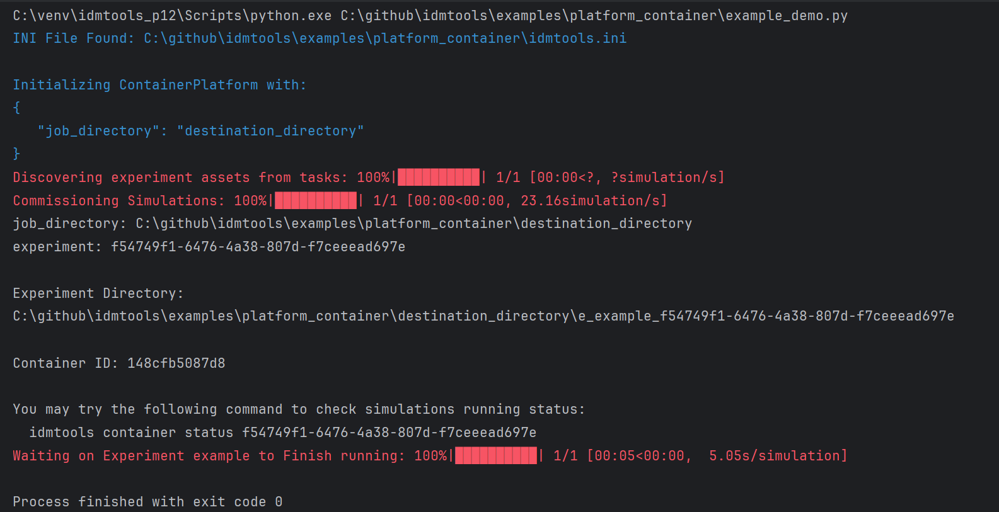
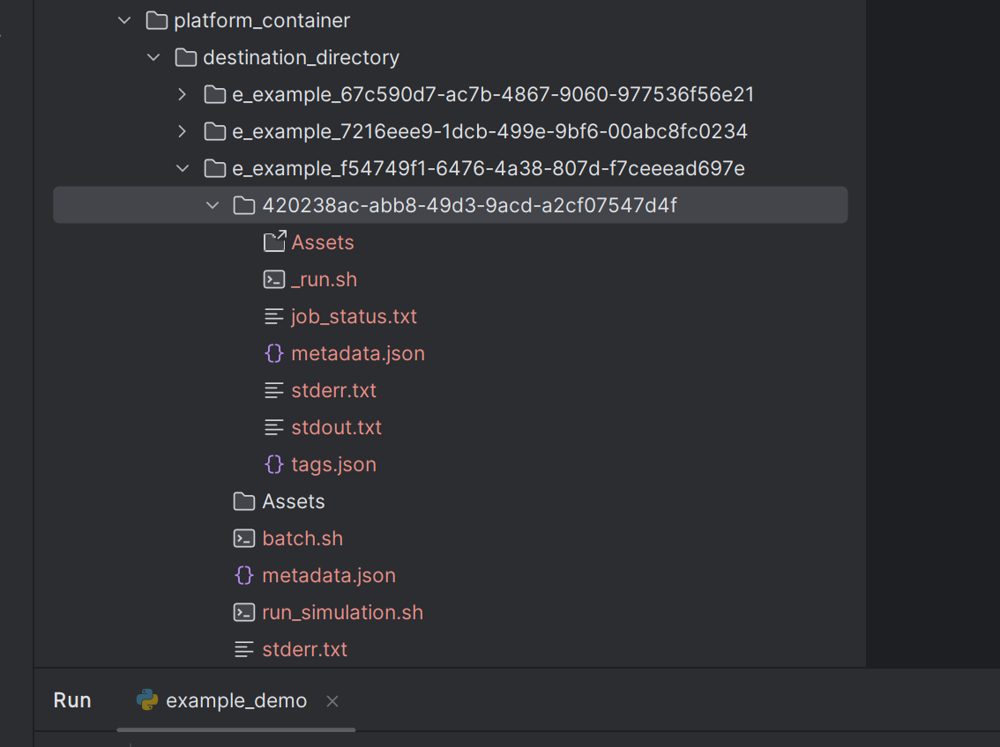
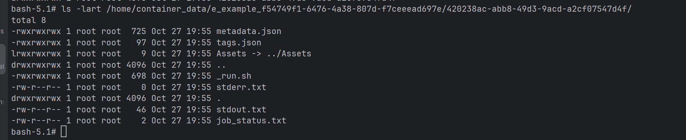

# Container platform

Comprehensive guide to using Docker containers with idmtools for reproducible simulations.

## Overview

The **Container Platform** allows the use of Docker containers and the ability to run jobs locally. This platform
leverages Docker's containerization capabilities to provide a consistent and isolated environment for running
computational tasks. The `ContainerPlatform` is responsible for managing the creation, execution, and cleanup of
Docker containers used to run simulations.

## Key features

- **Docker Integration**: Ensures that Docker is installed and the Docker daemon is running before executing any tasks.
- **Experiment and Simulation Management**: Provides methods to run and manage experiments and simulations within Docker containers.
- **Volume Binding**: Supports binding host directories to container directories, allowing for data sharing between the host and the container.
- **Container Validation**: Validates the status and configuration of Docker containers to ensure they meet the platform's requirements.
- **Script Conversion**: Converts scripts to Linux format if the host platform is Windows, ensuring compatibility within the container environment.
- **Job History Management**: Keeps track of job submissions and their corresponding container IDs for easy reference and management.
- **Minimal Docker image**: Requires only Linux OS, Python 3, and mpich installed in the Docker image. ContainerPlatform binds the host directory to the container directory for running the simulation.
- **Flexible simulation directory**: Customize the simulation output folder structure by including/excluding suite, experiment, or simulation names in the path.

## Prerequisites

- Docker installed and Docker daemon running
- Linux, or Windows with WSL2
- Python 3.10+ (64-bit)

### Set up a virtual environment

```bash
python -m venv container_env

# Windows
container_env\Scripts\activate

# Linux/macOS
source container_env/bin/activate
```

### Install idmtools

```bash
pip install idmtools[container]
```


### Windows-specific setup

**Enable Developer Mode** — required for Docker to create symlinks inside containers:

Settings → Update & Security → For Developers → Select **Developer Mode**

**Enable long path support** (if paths exceed 255 characters):

Local Computer Policy → Computer Configuration → Administrative Templates → System → Filesystem → Enable **Win32 long paths**

## ContainerPlatform attributes

| Attribute | Description |
|-----------|-------------|
| `job_directory` | The directory where job data is stored. |
| `docker_image` | The Docker image to run the container. |
| `extra_packages` | Additional packages to install in the container. |
| `data_mount` | The data mount point in the container. |
| `user_mounts` | User-defined mounts for additional volume bindings. |
| `container_prefix` | Prefix for container names. |
| `force_start` | Flag to force start a new container. |
| `new_container` | Flag to start a new container. |
| `include_stopped` | Flag to include stopped containers in operations. |
| `debug` | Flag to enable debug mode. |
| `container_id` | The ID of the container being used. |
| `max_job` | The maximum number of jobs to run in parallel. |
| `retries` | The number of retries to attempt for a job. |
| `ntasks` | Number of MPI processes. If greater than 1, it triggers mpirun. |

## Basic usage

Create a Python file named `example_demo.py` and add the following code:

```python
from idmtools.entities.command_task import CommandTask
from idmtools.entities.experiment import Experiment
from idmtools_platform_container.container_platform import ContainerPlatform

# Initialize the platform
from idmtools.core.platform_factory import Platform
platform = Platform('Container', job_directory="destination_directory")
# Or
# platform = ContainerPlatform(job_directory="destination_directory")

# Define task
command = "echo 'Hello, World!'"
task = CommandTask(command=command)

# Run an experiment
experiment = Experiment.from_task(task, name="example")
experiment.run(platform=platform)
```

Run on your host machine:

```bash
python example_demo.py
```

**Output**



Results saved in the `destination_directory` on the host machine:



Results inside the Docker container:



## Attribute examples

### extra_packages

Install additional packages into the container at runtime:

```python
from idmtools.assets import Asset, AssetCollection
from idmtools.core.platform_factory import Platform
from idmtools.entities.command_task import CommandTask
from idmtools.entities.experiment import Experiment
import os

platform = Platform("Container", job_directory="DEST", new_container=True,
                    extra_packages=['astor', 'numpy', 'pytest'],
                    docker_image="ghcr.io/institutefordiseasemodeling/container-rocky-runtime:0.0.6")
command = "python Assets/model_file.py"
task = CommandTask(command=command)

model_asset = Asset(absolute_path=os.path.join("inputs", "extra_packages", "model_file.py"))
common_assets = AssetCollection()
common_assets.add_asset(model_asset)

experiment = Experiment.from_task(task, name="run_with_extra_packages", assets=common_assets)
experiment.run(wait_until_done=True, platform=platform)
```

### new_container

Force a new container to be created for each experiment:

```python
with Platform("Container", job_directory="DEST", new_container=True) as platform:
    experiment.run(wait_until_done=True)
```

### docker_image

Use a specific Docker image:

```python
with Platform("Container", job_directory="DEST",
              docker_image="docker-production.packages.idmod.org/idmtools/container-test:0.0.3") as platform:
    experiment.run(wait_until_done=True)
```

### force_start

Force start a new or stopped container:

```python
with Platform("Container", job_directory="DEST", force_start=True) as platform:
    experiment.run(wait_until_done=True)
```

### user_mounts

Mount additional host directories into the container:

```python
import os

user_mounts = {
    os.path.join(os.getcwd(), 'inputs', 'python_models'): "/home/dest",
    os.path.dirname(os.getcwd()): "/home/dest2"
}
with Platform("Container", job_directory="DEST", user_mounts=user_mounts) as platform:
    experiment.run(wait_until_done=True)
```

### data_mount

Use a custom data mount point instead of the default `/home/container-data`:

```python
with Platform("Container", job_directory="DEST", data_mount="/home/data") as platform:
    experiment.run(wait_until_done=True)
```

### container_prefix

Add a prefix to container names:

```python
with Platform("Container", job_directory="DEST", container_prefix="my_project") as platform:
    experiment.run(wait_until_done=True)
```

### retries

Retry failed jobs automatically:

```python
from idmtools_platform_container.container_platform import ContainerPlatform

with ContainerPlatform(job_directory="DEST", retries=3) as platform:
    experiment.run(wait_until_done=True)
```

## Folder structure

By default, idmtools generates simulations with the following structure:

```
job_directory/s_<suite_name>_<suite_uuid>/e_<experiment_name>_<experiment_uuid>/<simulation_uuid>
```

- `job_directory` — base directory for all output
- `s_<suite_name>_<uuid>` — suite directory (name truncated to 30 characters, prefixed with `s_`)
- `e_<experiment_name>_<uuid>` — experiment directory (name truncated to 30 characters, prefixed with `e_`)
- `<simulation_uuid>` — simulation directory (UUID only)

If no suite is specified:

```
job_directory/e_<experiment_name>_<experiment_uuid>/<simulation_uuid>
```

**Example** — given suite name `my_very_long_suite_name_for_malaria_experiment` and experiment name `test_experiment_with_calibration_phase`:

```
job_directory/
└── s_my_very_long_suite_name_for_m_12345678-9abc-def0-1234-56789abcdef0/
    └── e_test_experiment_with_calibrati_abcd1234-5678-90ef-abcd-1234567890ef/
        └── 7c9e6679-7425-40de-944b-e07fc1f90ae7/
```

No-suite case:

```
job_directory/
└── e_test_experiment_with_calibrati_abcd1234-5678-90ef-abcd-1234567890ef/
    └── 7c9e6679-7425-40de-944b-e07fc1f90ae7/
```

You can customize the folder structure in `idmtools.ini`:

- `name_directory = False` — exclude suite and experiment names from the path
- `sim_name_directory = True` — include the simulation name in the path

Results inside the container are at `/home/container-data/<suite_path>/<experiment_path>/<simulation_path>`.

!!! note "Windows path length"
    Windows has a 255-character path limit. If needed, enable long path support via the Windows Group Policy Editor.

## Docker image

The default Docker image for `ContainerPlatform` is based on Rocky Linux 9.2 and includes:

- Python 3.9
- mpich 4.1.1
- numpy, pandas, scipy, matplotlib, and other common libraries for science community

The image is automatically built and published via GitHub Actions. You do not need to build it yourself.

To use a specific image:

```python
platform = Platform('Container', job_directory='any_dir',
                    docker_image='my_docker_image:x.x.x')
```

### Extend the Docker image

To build a custom image based on the default runtime:

```dockerfile
FROM ghcr.io/institutefordiseasemodeling/container-rocky-runtime:0.0.6

# Add your dependencies here
RUN pip install my-package
```

Build it and use it:

```python
platform = Platform('Container', job_directory='any_dir', docker_image='your_own_image_name:x.x.x')
```

### Build and publish (developers only)

```bash
# Build
python build_container_image.py

# Push
python build_container_image.py --push
```
Note: Build image script need GITHUB_TOKEN with read/write permission

## Docker utilities

The `docker_operations.py` module provides utilities to manage Docker containers within `ContainerPlatform`.

### Key functions

| Function | Description |
|----------|-------------|
| `validate_container_running(platform)` | Checks daemon, finds or starts a container |
| `get_container(container_id)` | Retrieves a container object by ID |
| `find_container_by_image(image)` | Finds containers matching a given image |
| `stop_container(container, remove=True)` | Stops and optionally removes a container |
| `stop_all_containers(containers)` | Stops all specified containers |
| `restart_container(container)` | Restarts a container |
| `is_docker_installed()` | Checks if Docker is installed |
| `is_docker_daemon_running()` | Checks if the Docker daemon is running |
| `check_local_image(image_name)` | Checks if an image exists locally |
| `pull_docker_image(image_name)` | Pulls an image from the registry |
| `list_running_jobs(container_id)` | Lists running jobs on a container |
| `find_running_job(item_id)` | Finds a running job by item ID |

### Example

```python
from idmtools_platform_container.container_operations.docker_operations import (
    validate_container_running, get_container, stop_container
)

# Validate and start a container
container_id = validate_container_running(platform)

# Retrieve a container object
container = get_container(container_id)

# Stop a container
stop_container(container)
```

## Limitations

!!! warning "Unsupported features"
    - **WorkItem** is not supported on the Container Platform.
    - **AssetCollection** creation or referencing an existing `AssetCollection` is not supported. If migrating from COMPS, remove code like:

        ```python
        # Remove this when using Container Platform
        asset_collection = AssetCollection.from_asset_collection_id('50002755-...')
        ```

    - **Singularity** is not needed with Container Platform. If migrating from COMPS, remove Singularity setup code:

        ```python
        # Remove this when using Container Platform
        emod_task.set_sif(sif_path)
        ```

## Next steps

- [Tutorials](../tutorials/index.md) - More detailed tutorials
- [User Guide](../user-guide/index.md) - General concepts
- [Platform Comparison](index.md) - Compare available platforms

## See also
- [Docker Documentation](https://docs.docker.com/)
