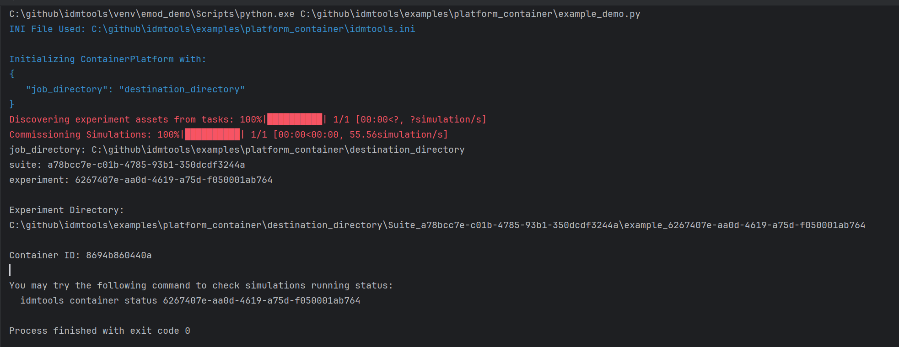
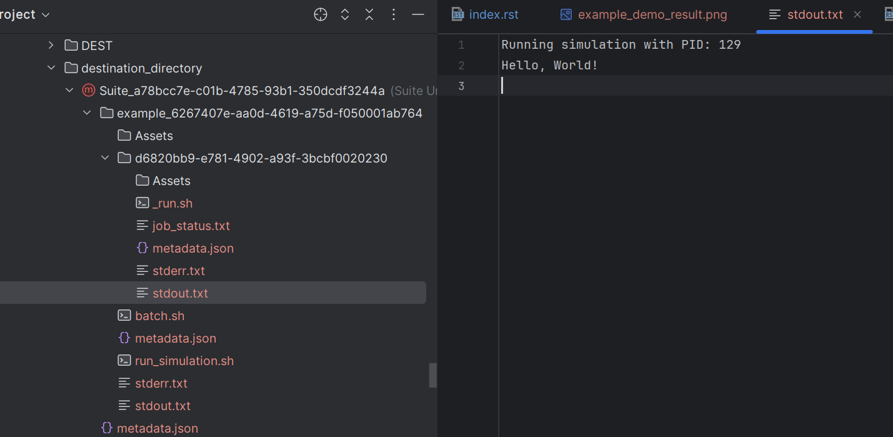
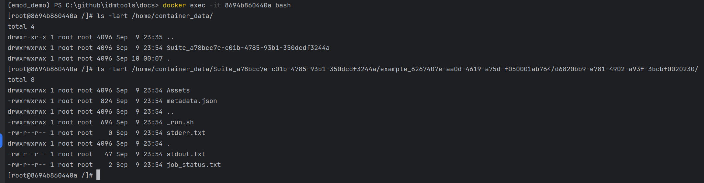

.. _Container Platform:

==================
Container Platform
==================

.. toctree::
    :maxdepth: 1

    utilis
    ../../cli/container/cli-detail
    options
    docker_image

Prerequisites
-------------
* Docker installed
* Linux or Windows with WSL2
* |Python_IT| (https://www.python.org/downloads/release)
* Create a virtual environment

  There are multiple ways to create a virtual environment. Below is an example using ``venv``:

  .. code-block:: bash

     python -m venv container_env

* Activate virtual environment

  - On Windows:

  .. code-block:: bash

     container_env\Scripts\activate

  - On Linux:

  .. code-block:: bash

     source container_env/bin/activate
* Install container platform

  .. code-block:: bash

     pip install idmtools[container] --index-url=https://packages.idmod.org/api/pypi/pypi-production/simple

ContainerPlatform
-----------------

The ``ContainerPlatform`` allows the use of Docker containers and the ability to run jobs locally. This platform leverages Docker's containerization capabilities to provide a consistent and isolated environment for running computational tasks. The ``ContainerPlatform`` is responsible for managing the creation, execution, and cleanup of Docker containers used to run simulations. It offers a high-level interface for interacting with Docker containers, allowing users to submit jobs, monitor their progress, and retrieve results.
For more details on the architecture and the packages included in |IT_s| and ``ContainerPlatform``, please refer to the documentation
(:doc:`../../reference`).

Key features
------------

- **Docker Integration**: Ensures that Docker is installed and the Docker daemon is running before executing any tasks.
- **Experiment and Simulation Management**: Provides methods to run and manage experiments and simulations within Docker containers.
- **Volume Binding**: Supports binding host directories to container directories, allowing for data sharing between the host and the container.
- **Container Validation**: Validates the status and configuration of Docker containers to ensure they meet the platform's requirements.
- **Script Conversion**: Converts scripts to Linux format if the host platform is Windows, ensuring compatibility within the container environment.
- **Job History Management**: Keeps track of job submissions and their corresponding container IDs for easy reference and management.
- **Minimal libraries and packages in Docker image**: Requires only Linux os, python3, mpich installed in docker image. ContainerPlatform will bind the host directory to the container directory for running the simulation.
- **Flexible simulation directory**: The user can customize the simulation output's folder structure by including/excluding the suite, experiment or simulations names in the simulation path.

.. _attributes:

ContainerPlatform attributes
----------------------------

- **job\_directory**: The directory where job data is stored.
- **docker\_image**: The Docker image to run the container.
- **extra_\packages**: Additional packages to install in the container.
- **data\_mount**: The data mount point in the container.
- **user\_mounts**: User-defined mounts for additional volume bindings.
- **container\_prefix**: Prefix for container names.
- **force\_start**: Flag to force start a new container.
- **new\_container**: Flag to start a new container.
- **include\_stopped**: Flag to include stopped containers in operations.
- **debug**: Flag to enable debug mode.
- **container\_id**: The ID of the container being used.
- **max\_job**: The maximum number of jobs to run in parallel.
- **retries**: The number of retries to attempt for a job.
- **ntasks**: Number of MPI processes. If greater than 1, it triggers mpirun.

Usage
-----

The ``ContainerPlatform`` class is typically used to run computational experiments and simulations within Docker containers, ensuring a consistent and isolated environment. It provides various methods to manage and validate containers, submit jobs, and handle data volumes.

Example
-------

This example demonstrates how to use the ``ContainerPlatform`` class to run a simple command task within a Docker container.

Create a Python file named `example_demo.py` on your host machine and add the following code:

.. code-block:: python

   from idmtools.entities.command_task import CommandTask
   from idmtools.entities.experiment import Experiment
   from idmtools_platform_container.container_platform import ContainerPlatform

   # Initialize the platform
   from idmtools.core.platform_factory import Platform
   platform = Platform('Container', job_directory="destination_directory")
   # Or
   # platform = ContainerPlatform(job_directory="destination_directory")
   # Define task
   command = "echo 'Hello, World!'"
   task = CommandTask(command=command)
   # Run an experiment
   experiment = Experiment.from_task(task, name="example")
   experiment.run(platform=platform)

To run `example_demo.py` in the virtual environment on the host machine:

.. code-block:: bash

    python example_demo.py

The running this example will output the following:

The output will be saved in the `destination_directory` folder on the host machine:

User can also view the same results inside the Docker container:

More examples
-------------
Run the following included Python example to submit and run a job on your |CONTAINER_s| platform:

.. literalinclude:: ../../../examples/platform_container/python_sims_for_containerplatform.py

Folder structure
----------------

By default, `idmtools` will generate simulations with the following structure:

`job_directory/suite_name_uuid/experiment_name_uuid/simulation_uuid`

    - `job_directory` is the base directory for suite, experiment and simulations.
    - `suite_name_uuid` is the name of the suite as prefix plus a suite uuid.
    - `experiment_name_uuid` is the name of the experiment plus a experiment uuid.
    - `simulation_uuid` is only simulation uuid.

    The user can customize the folder structure by setting the following parameters in the `idmtools.ini` file:
    - `name_directory = False`: The suite and experiment names will be excluded in the simulation path.
    - `sim_name_directory = True`: The simulation name will be included in the simulation path.

Additionally, You can view the same results inside the Docker container at `/home/container-data/<suite_path>/<experiment_path>/<simulation_path>`.
The `container-data` directory is the default data mount point in the container.

Note: If running the script on Windows, be aware of the file path length limitation (less than 255 characters).
If you really need to run the script with long file paths, you can set the Enable Long Path Support in Windows Group Policy Editor. refer to https://www.autodesk.com/support/technical/article/caas/sfdcarticles/sfdcarticles/The-Windows-10-default-path-length-limitation-MAX-PATH-is-256-characters.html.

.. note::

   - **WorkItem** is not supported on the Container Platform as it is not needed in most cases since the code already runs on user's local computer.
   - **AssetCollection** creation or referencing to an existing AssetCollection are not supported on the Container Platform with current release. If you've used the COMPS Platform, you may have scripts using these objects. You would need to update these scripts without using these objects in order to run them on the Container Platform.

     For example, you may need to remove the following code which used in COMPS Platform:

     .. code-block:: python

        asset_collection = AssetCollection.from_asset_collection_id('50002755-20f1-ee11-aa12-b88303911bc1')

   - Run with **Singularity** is not needed with Container Platform. If you take existing COMPS example and try to run it with Container Platform, you may need to remove the code that setups the singularity image.

     For example for singularity, you make need to remove the following code which used in COMPS Platform:

     .. code-block:: python

        emod_task.set_sif(sif_path)

