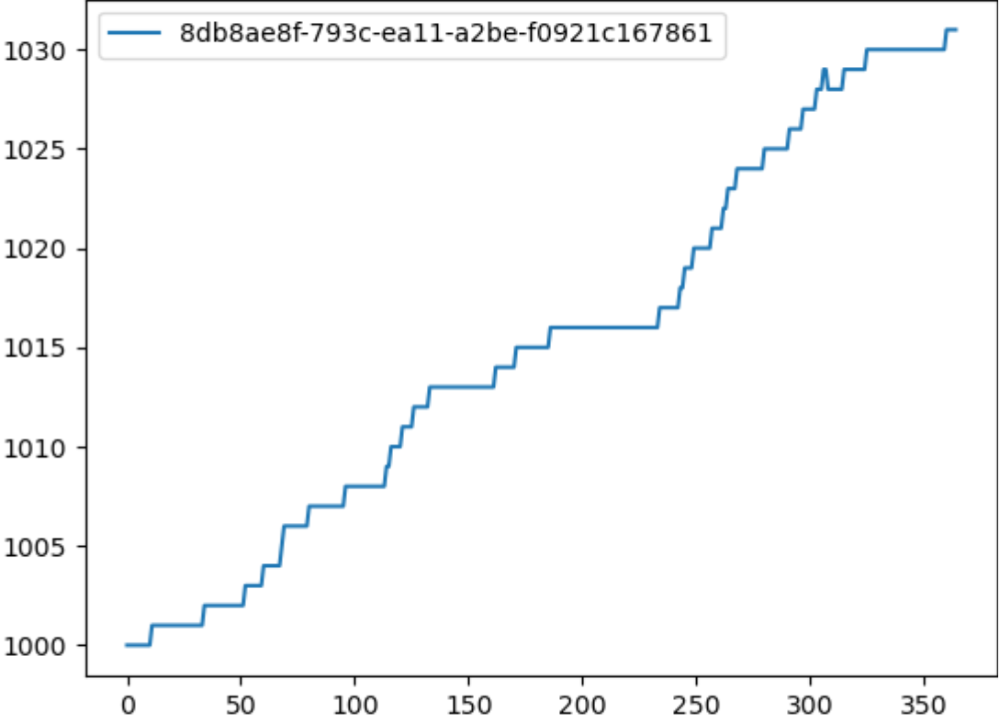

Plot data
=========

You can use |IT_s| to plot the output results of the analysis of simulations and experiments. You must include a plotting library within your script. For example, with Python a common plotting library is matplotlib (https://matplotlib.org/).

The following shows how to add matplotlib to a reduce method for plotting the output results of a population analyzer::

    def reduce(self, all_data: dict) -> Any:
        output_dir = os.path.join(self.working_dir, "output")

        with open(os.path.join(output_dir, "population.json"), "w") as fp:
            json.dump({str(s.uid): v for s, v in all_data.items()}, fp)

        import matplotlib.pyplot as plt

        fig = plt.figure()
        ax = fig.add_subplot()

        for pop in list(all_data.values()):
            ax.plot(pop)
        ax.legend([str(s.uid) for s in all_data.keys()])
        fig.savefig(os.path.join(output_dir, "population.png"))

The reduce method uses the output from the map method, which is **InsetChart.json**, as the input for plotting the results of the **Statistical Population** channel::

    filenames = ['output/InsetChart.json']

    def map(self, data: Any, item: IItem) -> Any:
        return data[self.filenames[0]]["Channels"]["Statistical Population"]["Data"]

The final results are plotted and saved to the file, population.png:

