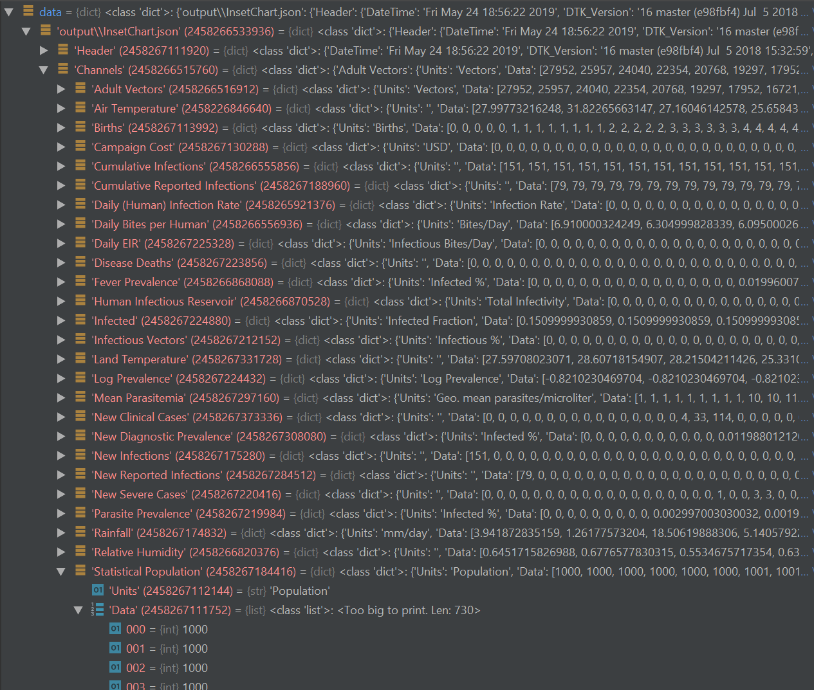
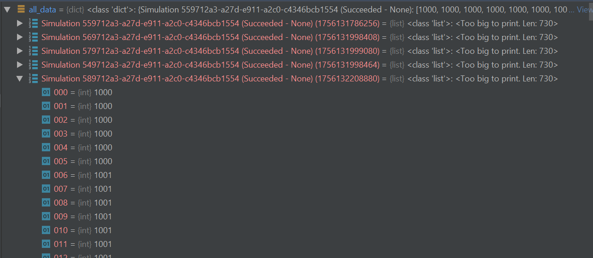

=========================
Creating custom analyzers
=========================

You can create customer analyzers for analysis of the simulation output results by extending the :py:class:`simtools.Analysis.BaseAnalyzers.BaseAnalyzer` class or any of the other base analyzer classes included with |DT|:

* :py:class:`~simtools.Analysis.BaseAnalyzers.BaseCacheAnalyzer`
* :py:class:`~simtools.Analysis.BaseAnalyzers.BaseCalibrationAnalyzer`
* :py:class:`~simtools.Analysis.BaseAnalyzers.DownloadAnalyzer`
* :py:class:`~simtools.Analysis.BaseAnalyzers.DownloadAnalyzerTPI`
* :py:class:`~simtools.Analysis.BaseAnalyzers.InsetChartAnalyzer`
* :py:class:`~simtools.Analysis.BaseAnalyzers.SimulationDirectoryMapAnalyzer`

The following documents the steps for creating a new population analyzer class by extending the :py:class:`~simtools.Analysis.BaseAnalyzers.BaseAnalyzer` class and then using the 
:py:class:`simtools.Analysis.AnalyzeManager` class for analyzing the results returned from the 
newly created **PopulationAnalyzer** class::

        from simtools.Analysis.BaseAnalyzers import BaseAnalyzer
        from simtools.Analysis.AnalyzeManager import AnalyzeManager

        class PopulationAnalyzer(BaseAnalyzer):
            def __init__(self):
                super().__init__(filenames=['output\\InsetChart.json'])

            def select_simulation_data(self, data, simulation):
                return data[self.filenames[0]]["Channels"]["Statistical Population"]["Data"]

            def finalize(self, all_data):
                import matplotlib.pyplot as plt
                for pop in list(all_data.values()):
                    plt.plot(pop)
                plt.legend([s.id for s in all_data.keys()])
                plt.show()

        if __name__ == "__main__":
            am = AnalyzeManager('latest', analyzers=PopulationAnalyzer())
            am.analyze()

#.  Create **PopulationAnalyzer** class to inherit from :py:class:`~simtools.Analysis.BaseAnalyzers.BaseAnalyzer` class::

        from simtools.Analysis.BaseAnalyzers import BaseAnalyzer
        class PopulationAnalyzer(BaseAnalyzer):

#.  Initialize an instance of the :py:class:`~simtools.Analysis.BaseAnalyzers.BaseAnalyzer` class by calling the **__init__** constructor method and pass in parameters to **self**, representing the class instance of **PopulationAnalyzer**::

        class PopulationAnalyzer(BaseAnalyzer):
            def __init__(self):
                super().__init__(filenames=['output\\InsetChart.json'])

The parameter, **filenames**, points to the simulation output path and specifies the files to download for analysis. In this example it points to a relative path in |COMPS_s| and to download InsetChart.json. For more information about InsetChart.json, see `Output files`_ .

3.  For each **simulation**, select parsed **data** from data dictionary and return the selected data (Statistical Population)::

        class PopulationAnalyzer(BaseAnalyzer):
            def select_simulation_data(self, data, simulation):
                return data[self.filenames[0]]["Channels"]["Statistical Population"]["Data"]

In this example the returned data is the parsed data from the **Statistical Population** channel, as shown in the following screenshot from Debugger mode in PyCharm:

4.  For the data in the **all_data** data dictionary, which contains the combined population data from each of the simulations, plot (using the Matplotlib plotting library) the population values for each simulation run in the experiment::

        def finalize(self, all_data):
            import matplotlib.pyplot as plt
            for pop in list(all_data.values()):
                plt.plot(pop)
            plt.legend([s.id for s in all_data.keys()])
            plt.show()

In this example a total of 5 simulations and their population values are included in the **all_data** data dictionary, as shown in the screenshot from Debugger mode in PyCharm:

5.  Use the **PopulationAnalyzer** class, inheriting from :py:class:`~simtools.Analysis.AnalyzeManager`, to analyze the data::

        from simtools.Analysis.AnalyzeManager import AnalyzeManager

        if __name__ == "__main__":
            am = AnalyzeManager('latest', analyzers=PopulationAnalyzer())
            am.analyze()

In this example, the population data from each of the 5 simulations are plotted using Matplotlib:

.. image:: images/alldata-plot.png
				:scale: 80%

.. _Output files: www.idmod.org/docs/general/software-outputs.html