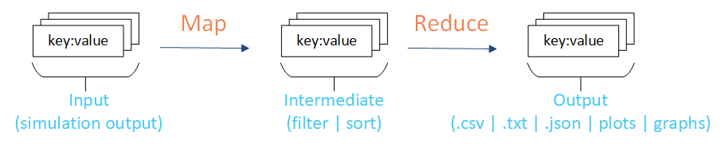
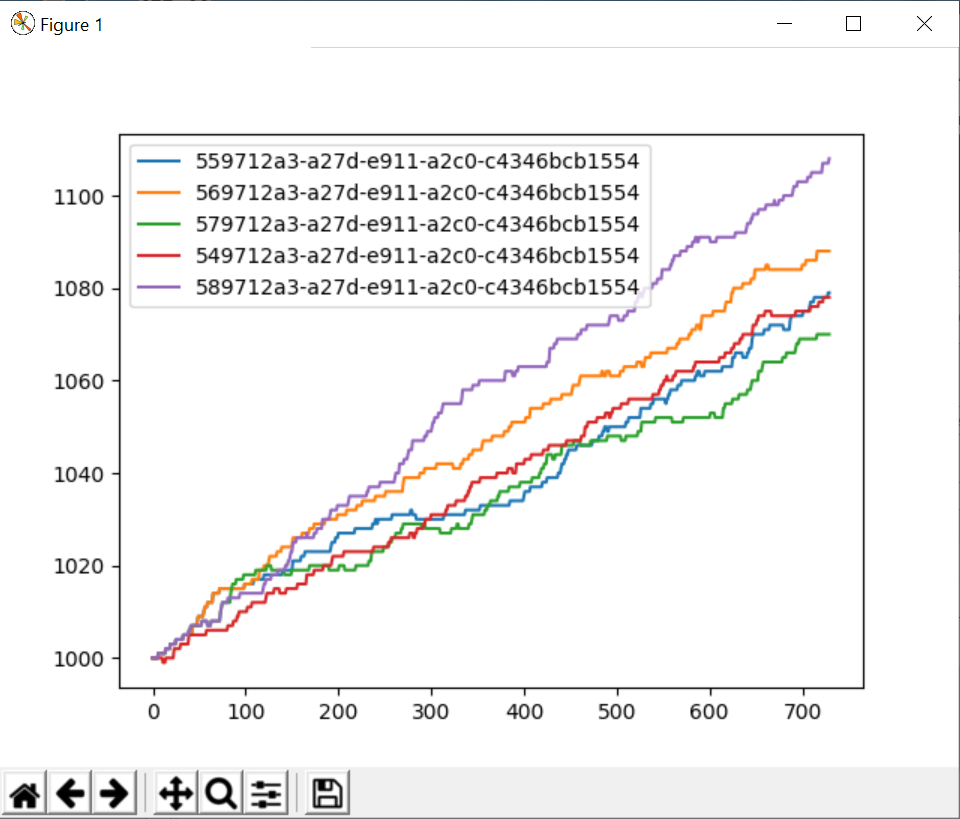

=========================
Introduction to analyzers
=========================

The analyzers and examples in |IT_s| provide support for the MapReduce framework, where you can process large data sets in parallel, typically on a :term:`high-performance computing (HPC)` cluster. The MapReduce framework includes two primary phases, Map and Reduce. Map takes input data, as key:value pairs, and creates an intermediate set of key:value pairs. Reduce takes the intermediate set of key:value pairs and transforms the data (typically reducing it) as output containing a final set of key:value pairs.

An example of this process with |IT_s| is to use the simulation output data as the input data (key:value pairs), filter and sort a subset of the data to focus on, and then combine and reduce the data to create the final output data.

The analyzers included with |IT_s| help facilitate this process. For example, if you would like to focus on specific data points from all simulations in one or more experiments then you can do this using analyzers with |IT_s| and plot the final output.

Example analyzers are inlucded with |IT_s| to help you get started. For more information, see :doc:`analyzers-example`.

You can also create custom analyzers to meet your individual analysis needs. For more information, see :doc:`analyzers-create`.

Integration with |SSMT_l| increases the performance of running analyzers. You may find this useful when running multiple analyzers across multiple experiments.

.. toctree::

   analyzers-example
   analyzers-create
   analyzers-convert